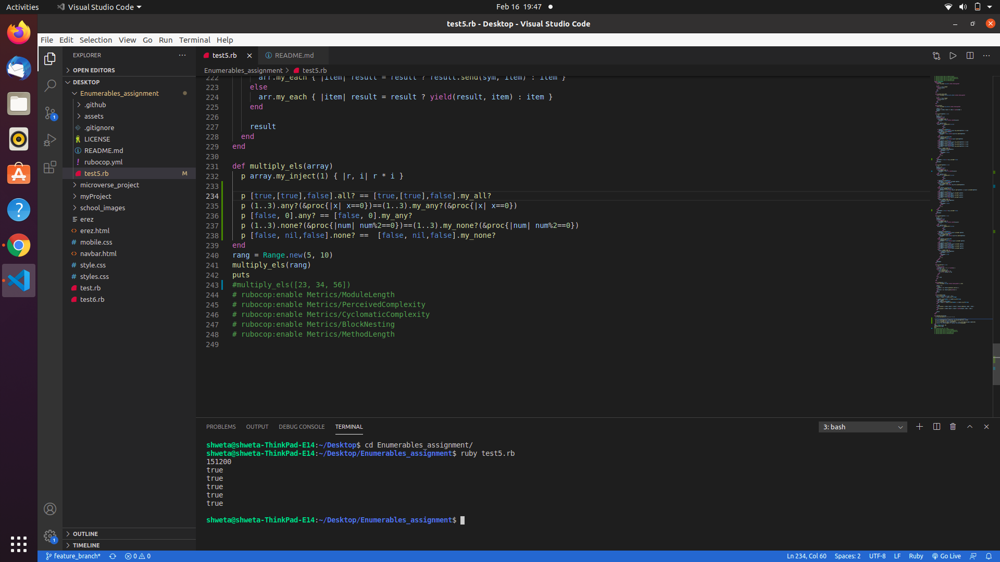

# Enumerables_assignment

Enumerable_assignment contains the customised method which behave as original methods
can be used as example below:
here array can be any Array or range these method behave as original methods
  array.my_each do |i|
    r = r+i
  end
  print r
  arr.my_each{|r| puts r if r != 6}
  array.my_each_with_index{ |r, i| puts i if r != 6}
  print(array.my_select{|n| n > 7})
  p array.my_none? {|n| n == 3 }
  p array.my_all? {|n| n == 3 }
  p array.my_any? {|n| n == 3 }
  p array.my_count(4)
  p array.my_map{|n| n*4} 
  print(array.my_inject(:*))
  p arr.my_inject(1) { |r, i| r * i }
  p array.my_none?(Integer)
  p array.my_all?(Integer)
  p array.my_any?(String)
   arr =["ruby"]
  p arr.all?(/r/)
  p arr.my_all?(/r/)
  p arr.none?(/r/)
  p arr.my_none?(/r/)
  p arr.my_any?(/r/)
  p arr.any?(/r/)
  block = proc { |num| num <  2 }
  false_block = proc { |num| num > 9 }
true_block = proc { |num| num <= 9 }
  p array.my_count(&false_block)
  p array.count(&false_block)
  p array.my_none?(23)
  p array.none?(23)
  words = %w[programmer computer house car]
  p words.my_none?("to")
  p words.none?("to")
  p array.all?(Integer)
  p array.my_all?(Integer)
  p array.any?(7)
  p array.my_any?(7)
  words = %w[programmer computer house car]
  puts
  p words.all?("car")
  p words.my_all?("car")
  p words.any?("car")
  p words.my_any?("car")
  puts
  p words.all?(5)
  p words.any?(5)
  p words.my_any?(5)
  puts
  p words.my_none?("car")
  p words.none?("car")
  p words.my_any?("car")
  p words.any?("car")
  block = proc { |num| num <  2 }
  false_block = proc { |num| num > 9 }
true_block = proc { |num| num <= 9 }
  #p array.my_count(&false_block)
  p array.my_count(&block)
  p array.count(&block)
  puts
  p array.my_count
  p array.count
  puts

multiply_els method can take input as array or range
  
## Built with

ruby

## Authors 👤

### Shweta Srivastava

_[Github](https://github.com/vidhishweta01)

_[LinkedIn](http://linkedin.com/in/shweta-s-15a57070)

## Show your support ⭐️⭐️

Give a star if you like this project!

## License 📝

This project is [MIT](https://www.mit.edu/~amini/LICENSE.md) licensed.